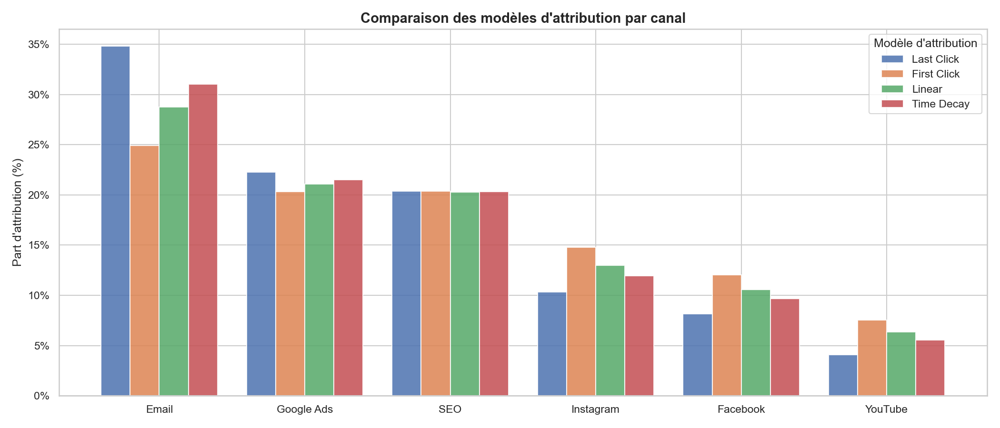
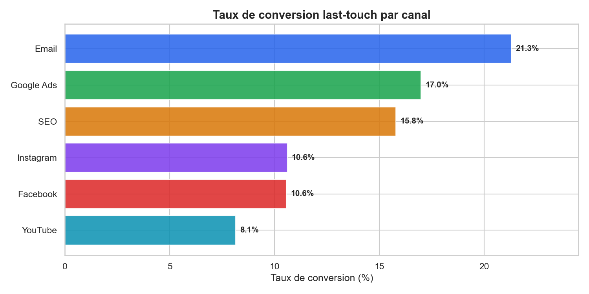
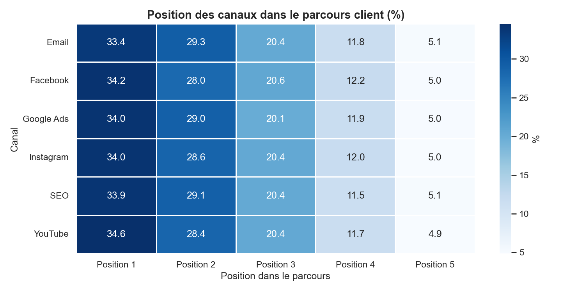
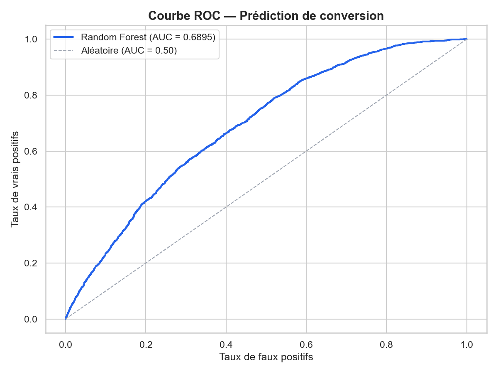
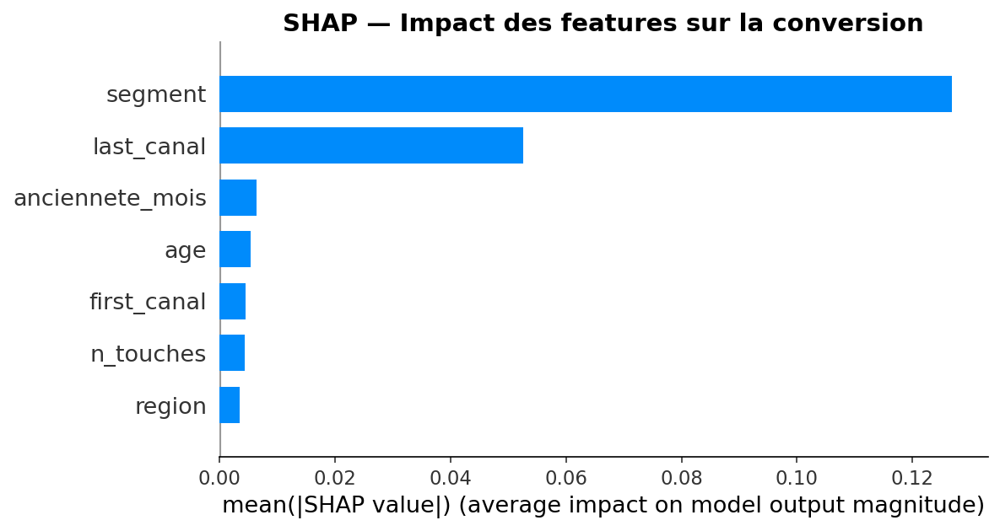
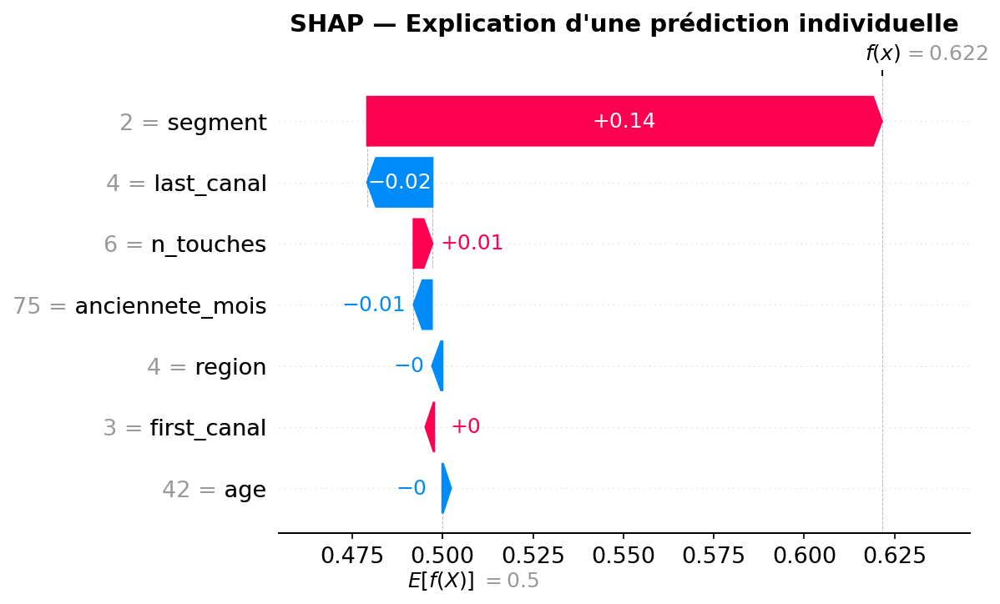

# 📊 Marketing Customer Journey Pipeline

> **Analyse du parcours client multitouch & prédiction de conversion | Multitouch Customer Journey Analysis & Conversion Prediction**


---

## 🇫🇷 Présentation du projet

Ce projet simule et analyse un **pipeline de données de parcours client multitouch**, inspiré de mon travail chez **Bouygues Telecom** (pôle Big Data) où j'analysais l'efficacité des canaux marketing et le parcours client.

L'objectif : modéliser le comportement de 50 000 clients à travers 6 canaux marketing (Email, Google Ads, SEO, Instagram, Facebook, YouTube), calculer des **modèles d'attribution marketing** (Last Click, First Click, Linear, Time Decay) et **prédire la conversion** avec un modèle Random Forest.

> Le dataset est synthétique et simulé avec des paramètres réalistes inspirés des benchmarks marketing sectoriels 2022-2024 — ce type de données reste propriétaire en entreprise.

### Ce que ce projet démontre

- Simulation de données réalistes avec NumPy (distributions statistiques, patterns métier)
- Conception d'un pipeline ETL modulaire en Python sur données multitables
- Implémentation de 4 modèles d'attribution marketing from scratch (Last Click, First Click, Linear, Time Decay)
- Analyse du parcours client multitouch : position des canaux, séquences de conversion
- Modèle de prédiction de conversion avec Scikit-learn (Random Forest, gestion du déséquilibre de classes)
- Dashboard interactif avec filtres dynamiques et console SQL (Streamlit)

---

## 🇬🇧 Project Overview

This project simulates and analyzes a **multitouch customer journey data pipeline**, inspired by my apprenticeship at **Bouygues Telecom** (Big Data division) where I analyzed marketing channel effectiveness and customer journeys.

The goal: model the behavior of 50,000 customers across 6 marketing channels (Email, Google Ads, SEO, Instagram, Facebook, YouTube), compute **marketing attribution models** (Last Click, First Click, Linear, Time Decay), and **predict conversion** using a Random Forest classifier.

> The dataset is synthetic, generated with realistic parameters based on 2022-2024 marketing industry benchmarks — this type of data remains proprietary in enterprise settings.

### What this project demonstrates

- Realistic data simulation with NumPy (statistical distributions, business patterns)
- Modular ETL pipeline design in Python on multi-table data
- Implementation of 4 marketing attribution models from scratch
- Multitouch customer journey analysis: channel position, conversion sequences
- Conversion prediction model with Scikit-learn (Random Forest, class imbalance handling)
- Interactive dashboard with dynamic filters and SQL console (Streamlit)

---

## 📐 Choix de conception du dataset synthétique

Les données étant propriétaires en entreprise, ce dataset a été entièrement 
simulé avec NumPy en s'appuyant sur des benchmarks marketing sectoriels 2022-2024.

### Paramètres des canaux marketing

| Canal | Poids | Taux de conversion last-touch | Position typique |
|-------|-------|-------------------------------|------------------|
| Email | 25% | 18% | Closing (fin de parcours) |
| SEO | 20% | 12% | Découverte (début) |
| Google Ads | 20% | 14% | Découverte (début) |
| Instagram | 15% | 8% | Milieu de parcours |
| Facebook | 12% | 7% | Milieu de parcours |
| YouTube | 8% | 5% | Découverte (début) |

> Ces taux s'inspirent des benchmarks Salesforce State of Marketing 2023 
> et HubSpot Marketing Report 2023 pour le secteur télécom/e-commerce.

### Segments clients

| Segment | Part | Bonus conversion |
|---------|------|-----------------|
| Premium | 20% | +15% |
| Standard | 45% | +5% |
| Low-Value | 25% | -5% |
| Churner | 10% | -10% |

> La distribution des segments reflète une base client télécom typique,
> inspirée des structures observées chez les opérateurs français.

---

## 🗂️ Project Structure
```
projet-marketing-data/
│
├── data/
│   ├── raw/                        # Fichiers CSV générés
│   │   ├── clients.csv             # 50 000 clients
│   │   └── touchpoints.csv         # ~150 000 interactions
│   └── processed/
│       ├── marketing.db            # Base SQLite
│       └── model.pkl               # Modèle Random Forest sauvegardé
│
├── src/
│   ├── __init__.py
│   ├── generate.py                 # Simulation du dataset
│   ├── extract.py                  # Chargement des CSV
│   ├── transform.py                # Nettoyage + modèles d'attribution
│   ├── load.py                     # Sauvegarde SQLite
│   ├── analyze.py                  # Génération des visualisations
│   └── model.py                    # Modèle ML Random Forest
│
├── outputs/                        # Graphiques générés (PNG)
│   ├── attribution_comparaison.png
│   ├── taux_conversion_canal.png
│   ├── distribution_touchpoints.png
│   ├── heatmap_position_canal.png
│   ├── conversion_par_segment.png
│   ├── feature_importance.png
│   ├── roc_curve.png
│   └── confusion_matrix.png
│
├── notebooks/                      # Notebooks exploratoires
├── app.py                          # Dashboard Streamlit
├── main.py                         # Point d'entrée du pipeline
├── requirements.txt
└── README.md
```

---

## ⚙️ Pipeline Architecture
```
[ GENERATE ] ── generate.py
  Simulation de 50 000 clients + ~150 000 touchpoints
  avec patterns réalistes par canal et segment
        │
        ▼
[ EXTRACT ] ─── extract.py
  Chargement des CSV en DataFrames Pandas
        │
        ▼
[ TRANSFORM ] ── transform.py
  • Nettoyage et typage des données
  • Calcul des 4 modèles d'attribution
  • Stats de performance par canal
        │
        ▼
[ LOAD ] ──────── load.py
  Sauvegarde dans SQLite (4 tables)
        │
        ▼
[ ANALYZE ] ───── analyze.py
  8 visualisations → outputs/
        │
        ▼
[ MODEL ] ──────── model.py
  Random Forest · AUC-ROC 0.69 · Recall 73%
        │
        ▼
[ DASHBOARD ] ─── app.py
  Streamlit · Filtres dynamiques · Console SQL
```

---

## 📊 Modèles d'attribution

| Modèle | Description | Usage |
|--------|-------------|-------|
| **Last Click** | 100% du crédit au dernier canal | Standard industrie |
| **First Click** | 100% du crédit au premier canal | Analyse de découverte |
| **Linear** | Crédit équiréparti entre tous les canaux | Vision équilibrée |
| **Time Decay** | Crédit pondéré par proximité à la conversion | Valorise les canaux de closing |

### Résultats clés

| Canal | Last Click | First Click | Taux conversion |
|-------|-----------|-------------|-----------------|
| Email | 34.80% | 24.91% | 21.30% |
| Google Ads | 22.25% | 20.32% | 16.99% |
| SEO | 20.37% | 20.37% | 15.79% |
| Instagram | 10.33% | 14.78% | 10.61% |
| Facebook | 8.14% | 12.06% | 10.56% |
| YouTube | 4.10% | 7.56% | 8.14% |

> **Insight clé** : L'Email convertit majoritairement en last-touch (34.80%) mais initie peu les parcours (24.91%). YouTube à l'inverse est un canal de découverte (7.56% first-click) rarement décisif en conversion (4.10% last-click).

---

## 🤖 Modèle ML — Random Forest

| Métrique | Valeur |
|----------|--------|
| **AUC-ROC** | 0.6895 |
| **Recall (convertis)** | 73% |
| **Features** | Âge, segment, région, ancienneté, nb touchpoints, first/last canal |
| **Gestion déséquilibre** | `class_weight="balanced"` |

---

## 📈 Visualisations

### Attribution par canal


### Taux de conversion last-touch


### Heatmap position des canaux


### Courbe ROC


### 🔍 Explicabilité abilité du modèle — SHAP

#### Summary plot — Impact global des features


> **Lecture** : Chaque barre représente l'impact moyen d'une feature sur les
> prédictions du modèle (mean absolute SHAP value). Plus la barre est longue,
> plus la feature influence la décision du modèle.

**Insights clés** :
- Le **segment client** (Premium, Standard, Low-Value, Churner) est de loin
  la feature la plus déterminante — le profil client prime sur tout le reste
- Le **canal last-touch** arrive en 2ème position, confirmant que le canal
  de conversion a un impact réel sur la prédiction
- L'âge, l'ancienneté, le canal first-touch et la région ont un impact marginal

#### Waterfall plot — Explication d'une prédiction individuelle


> **Lecture** : Ce graphique décompose la prédiction d'un client spécifique.
> La valeur de base E[f(x)] = 0.5 est la prédiction moyenne du modèle.
> Chaque barre montre comment une feature pousse la prédiction vers le haut
> (rouge, favorable à la conversion) ou vers le bas (bleu, défavorable).
> La valeur finale f(x) = 0.622 indique une probabilité de conversion de 62%.

---

## 🚀 Installation & Usage

### Prérequis / Prerequisites
- Python 3.11+

### Setup
```bash
# Cloner le dépôt / Clone the repository
git clone https://github.com/PhilippeMARTINS/projet-marketing-data.git
cd projet-marketing-data

# Créer l'environnement virtuel / Create virtual environment
python -m venv venv
source venv/bin/activate      # Linux / Mac
venv\Scripts\activate         # Windows

# Installer les dépendances / Install dependencies
pip install -r requirements.txt
```

### Lancer le pipeline complet / Run the full pipeline
```bash
python main.py
```

### Lancer le dashboard / Run the dashboard
```bash
streamlit run app.py
```

---

## 🛠️ Tech Stack

| Outil | Usage |
|-------|-------|
| **Python 3.11** | Langage principal |
| **NumPy** | Simulation du dataset |
| **Pandas** | Manipulation des données |
| **SQLite** | Persistance & requêtes analytiques |
| **Scikit-learn** | Modèle Random Forest |
| **Matplotlib / Seaborn** | Visualisations |
| **Streamlit** | Dashboard interactif |
| **Joblib** | Sauvegarde du modèle |

---

## 👤 Auteur / Author

**Philippe Morais Martins** — Data Engineer / Scientist  
M2 Data Engineering · Paris Ynov Campus  
Anglais courant · Portugais bilingue

📧 philippe.martins@hotmail.com  
🔗 [LinkedIn](https://linkedin.com/in/) ← *(à compléter)*  
💻 [GitHub](https://github.com/PhilippeMARTINS)