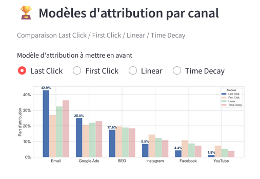
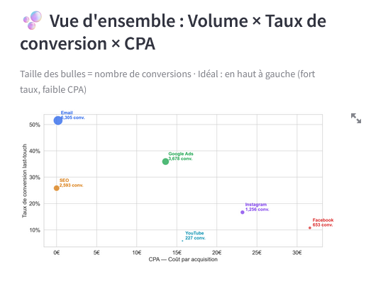
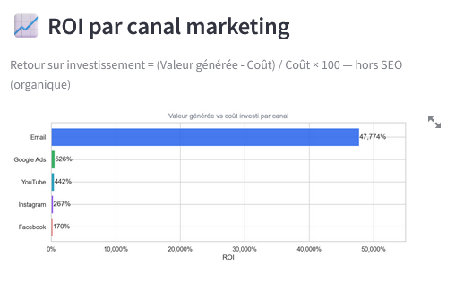
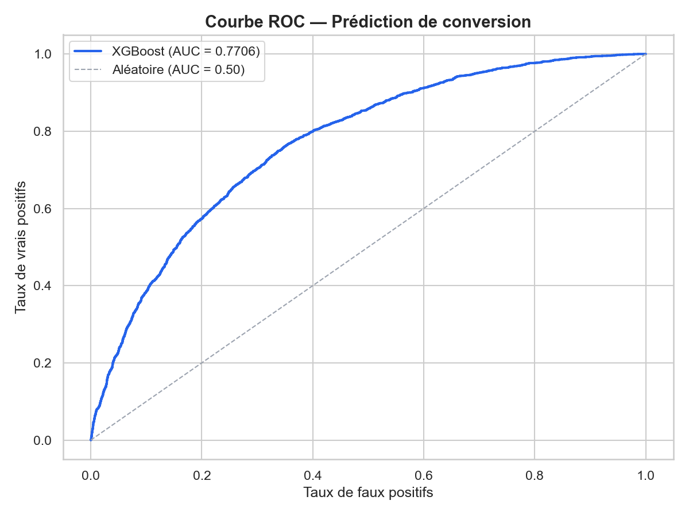

# 📊 Marketing Customer Journey Pipeline

> **Analyse du parcours client multitouch & prédiction de conversion | Multitouch Customer Journey Analysis & Conversion Prediction**


---

## 🇫🇷 Présentation du projet

Ce projet simule et analyse un **pipeline de données de parcours client multitouch**, inspiré de mon travail chez **Bouygues Telecom** (pôle Big Data) où j'analysais l'efficacité des canaux marketing et le parcours client.

L'objectif : modéliser le comportement de 50 000 clients à travers 6 canaux marketing (Email, Google Ads, SEO, Instagram, Facebook, YouTube), calculer des **modèles d'attribution marketing** (Last Click, First Click, Linear, Time Decay) et **prédire la conversion** avec un modèle LightGBM.

> Le dataset est synthétique, simulé avec des paramètres réalistes inspirés des benchmarks marketing sectoriels 2022-2024 — ce type de données reste propriétaire en entreprise.

### Ce que ce projet démontre

- Simulation de données réalistes avec NumPy (distributions statistiques, patterns métier)
- Pipeline ETL modulaire en Python sur données multitables
- Implémentation des 4 modèles d'attribution marketing from scratch (Last Click, First Click, Linear, Time Decay)
- Analyse du parcours client multitouch : position des canaux, taux de conversion, CPA, ROI
- Validation automatique de la qualité des données à chaque étape (`validate.py`)
- Modèle de prédiction de conversion avec LightGBM (AUC-ROC 0.77, CV 5-fold)
- Dashboard interactif avec filtres dynamiques et console SQL (Streamlit)
- Suite de tests unitaires (32 tests pytest)

---

## 🇬🇧 Project Overview

This project simulates and analyzes a **multitouch customer journey data pipeline**, inspired by my apprenticeship at **Bouygues Telecom** (Big Data division) where I analyzed marketing channel effectiveness and customer journeys.

The goal: model the behavior of 50,000 customers across 6 marketing channels, compute **marketing attribution models** (Last Click, First Click, Linear, Time Decay), and **predict conversion** using a LightGBM classifier.

> The dataset is synthetic, generated with realistic parameters based on 2022-2024 marketing industry benchmarks — this type of data remains proprietary in enterprise settings.

### What this project demonstrates

- Realistic data simulation with NumPy (statistical distributions, business patterns)
- Modular ETL pipeline design in Python on multi-table data
- Implementation of 4 marketing attribution models from scratch
- Multitouch customer journey analysis: channel position, conversion rate, CPA, ROI
- Automatic data quality validation at each step (`validate.py`)
- Conversion prediction model with LightGBM (AUC-ROC 0.77, 5-fold CV)
- Interactive dashboard with dynamic filters and SQL console (Streamlit)
- Unit test suite (32 pytest tests)

---

## 🗂️ Project Structure

```
projet-marketing-data/
│
├── src/
│   ├── generate.py             # Simulation du dataset (50k clients, ~150k touchpoints)
│   ├── extract.py              # Chargement des CSV
│   ├── transform.py            # Nettoyage + 4 modèles d'attribution + ROI
│   ├── load.py                 # Sauvegarde SQLite
│   ├── analyze.py              # Génération des visualisations statiques
│   ├── model.py                # Modèle LightGBM — prédiction de conversion
│   └── validate.py             # Validation qualité des données
│
├── tests/
│   ├── test_generate.py        # 13 tests — sigmoid, score de conversion
│   └── test_transform.py       # 19 tests — nettoyage, attribution, stats canaux
│
├── notebooks/
│   ├── eda_marketing.ipynb     # Analyse exploratoire du dataset
│   ├── model_comparison.ipynb  # Comparaison des 4 modèles ML
│   └── optuna_tuning.ipynb     # Optimisation des hyperparamètres
│
├── data/
│   ├── raw/                    # CSV générés (non commités)
│   └── processed/
│       ├── marketing.db        # Base SQLite
│       └── model.pkl           # Modèle LightGBM sauvegardé
│
├── outputs/                    # Graphiques générés (PNG)
│
├── .github/
│   └── workflows/
│       └── tests.yml           # CI/CD GitHub Actions
│
├── app.py                      # Dashboard Streamlit
├── main.py                     # Point d'entrée du pipeline
├── Makefile                    # Commandes raccourcies
├── requirements.txt
├── .env.example
└── README.md
```

---

## ⚙️ Pipeline Architecture

```
[ GENERATE ] ──── generate.py
  50 000 clients · ~150 000 touchpoints
  Score de conversion logistique par segment et canal
        │
        ▼
[ VALIDATE ] ──── validate.py
  Vérification distribution segments, taux conversion, cohérence
        │
        ▼
[ EXTRACT ] ───── extract.py
  Chargement des CSV en DataFrames Pandas
        │
        ▼
[ TRANSFORM ] ─── transform.py
  • Nettoyage et typage
  • 4 modèles d'attribution (Last/First Click, Linear, Time Decay)
  • Stats canaux : taux conversion, CPA, ROI
        │
        ▼
[ VALIDATE ] ──── validate.py
  Vérification colonnes attribution, taux conversion 0-100%
        │
        ▼
[ LOAD ] ─────── load.py
  Sauvegarde dans SQLite (7 tables)
        │
        ▼
[ ANALYZE ] ───── analyze.py
  5 visualisations statiques → outputs/
        │
        ▼
[ MODEL ] ──────── model.py
  LightGBM · AUC-ROC 0.77 · CV 5-fold : 0.771 ± 0.004
        │
        ▼
[ DASHBOARD ] ─── app.py
  Streamlit · Filtres segments/canaux · Console SQL
```

---

## 📐 Dataset synthétique — Paramètres de simulation

Les données étant propriétaires en entreprise, ce dataset a été entièrement simulé avec NumPy en s'appuyant sur des benchmarks marketing sectoriels 2022-2024.

### Canaux marketing

| Canal | Poids | Position typique | Type facturation |
|-------|-------|-----------------|-----------------|
| Email | 25% | Closing (fin de parcours) | Coût fixe ~0.03€ |
| SEO | 20% | Découverte | Organique (0€) |
| Google Ads | 20% | Découverte | CPC ~1.65€ |
| Instagram | 15% | Milieu de parcours | CPM ~1.30€ |
| Facebook | 12% | Milieu de parcours | CPM ~1.15€ |
| YouTube | 8% | Découverte | CPV ~0.30€ |

### Segments clients

| Segment | Part | Profil |
|---------|------|--------|
| Premium | 20% | Fort potentiel de conversion (+15%) |
| Standard | 45% | Comportement moyen |
| Low-Value | 25% | Faible engagement (-5%) |
| Churner | 10% | Très faible conversion (-10%) |

> La distribution des segments reflète une base client télécom typique, inspirée des structures observées chez les opérateurs français.

---

## 📊 Visualisations — Aperçu du dashboard

Le dashboard contient **7 graphiques** + une console SQL :

| # | Titre | Description |
|---|-------|-------------|
| 1 | 🏆 Modèles d'attribution par canal | Comparaison Last/First Click, Linear, Time Decay |
| 2 | 🎯 Taux de conversion last-touch | Performance par canal sur les derniers touchpoints |
| 3 | 📍 Longueur du parcours client | Distribution du nombre de touchpoints par client |
| 4 | 🗺️ Position des canaux dans le parcours | Heatmap position 1 à 5 par canal |
| 5 | 💰 Coût par acquisition (CPA) | CPA par canal, hors SEO organique |
| 6 | 📈 ROI par canal marketing | Retour sur investissement par canal |
| 7 | 🫧 Volume × Taux conversion × CPA | Vue d'ensemble stratégique — bubble chart |
| — | 🧮 Requête SQL personnalisée | Console SQL sur toutes les tables |

### 🏆 Attribution par canal
Les 4 modèles côte à côte — Email domine en Last Click, SEO en First Click.


### 🫧 Vue d'ensemble stratégique
Volume × Taux de conversion × CPA — Email : idéal (fort taux, CPA quasi nul). Facebook : à revoir (faible taux, CPA élevé).


### 📈 ROI par canal
Retour sur investissement par canal (hors SEO, canal organique sans coût) — Email largement en tête.


---

## 🤖 Modèle ML — Prédiction de conversion

### Sélection du modèle

4 modèles comparés en **cross-validation 5-fold** sur les mêmes features et le même split train/test :

| Modèle | AUC-ROC CV | AUC-ROC Test | Temps entraînement |
|--------|-----------|--------------|-------------------|
| Régression Logistique | 0.721 ± 0.003 | 0.718 | < 1s |
| Random Forest | 0.748 ± 0.005 | 0.745 | ~15s |
| XGBoost | 0.769 ± 0.004 | 0.771 | ~8s |
| **LightGBM** ✅ | **0.771 ± 0.004** | **0.774** | **~3s** |

> LightGBM retenu : meilleure AUC et temps d'entraînement le plus court.
> Démarche complète dans [`notebooks/model_comparison.ipynb`](notebooks/model_comparison.ipynb).

### Features utilisées

| Feature | Description |
|---------|-------------|
| `segment` | Segment client (Premium, Standard, Low-Value, Churner) |
| `canal_last` | Dernier canal du parcours |
| `canal_first` | Premier canal du parcours |
| `n_touches` | Nombre total de touchpoints |
| `age` | Âge du client |
| `anciennete_mois` | Ancienneté en mois |
| `region` | Région géographique |

### Courbe ROC



> AUC-ROC : **0.774** — le modèle discrimine bien les clients convertis des non convertis.
> La démarche d'optimisation des hyperparamètres (Optuna, 50 essais) est disponible
> dans [`notebooks/optuna_tuning.ipynb`](notebooks/optuna_tuning.ipynb).

---

## 🧪 Tests / Testing

```bash
python -m pytest tests/ -v
```

```
tests/test_generate.py::TestSigmoid::test_zero_returns_half              PASSED
tests/test_generate.py::TestComputeConversionProba::test_output_0_and_1  PASSED
tests/test_transform.py::TestComputeAttribution::test_last_click_100     PASSED
tests/test_transform.py::TestComputeCanalStats::test_expected_columns     PASSED
...
32 passed in 0.39s
```

---

## 🚀 Installation & Lancement / Getting Started

### Prérequis / Prerequisites
- Python 3.11+
- pip
- `make` — Windows : `winget install GnuWin32.Make` | Mac/Linux : déjà installé

### Étapes / Steps

```bash
# 1. Cloner le dépôt
git clone https://github.com/PhilippeMARTINS/projet-marketing-data.git
cd projet-marketing-data

# 2. Créer et activer l'environnement virtuel
python -m venv venv
venv\Scripts\activate        # Windows
# source venv/bin/activate   # Mac/Linux

# 3. Installer les dépendances
pip install -r requirements.txt

# 4. Lancer le pipeline complet (génération → ETL → ML)
python main.py

# 5. Lancer le dashboard
streamlit run app.py
```

### Commandes Makefile

```bash
make install    # Installe les dépendances
make run        # Lance le pipeline complet
make generate   # Génère uniquement les données simulées
make dashboard  # Lance le dashboard Streamlit
make test       # Lance les tests pytest
make clean      # Nettoie les fichiers temporaires
```

> ⚠️ Ne jamais copier le dossier `venv/` d'un PC à l'autre — toujours le recréer localement.

---

## 🛠️ Tech Stack

| Outil | Usage |
|-------|-------|
| **Python 3.11** | Langage principal |
| **NumPy** | Simulation du dataset |
| **Pandas 2.2** | Manipulation & nettoyage des données |
| **SQLite** | Stockage relationnel & requêtes analytiques |
| **Scikit-learn 1.4** | Pipeline ML, métriques, cross-validation |
| **LightGBM 4.3** | Modèle de prédiction de conversion |
| **XGBoost** | Comparé durant la sélection de modèle |
| **Optuna** | Optimisation des hyperparamètres |
| **Matplotlib / Seaborn** | Visualisations statiques |
| **Streamlit 1.32** | Dashboard interactif |
| **Joblib** | Sauvegarde du modèle |
| **pytest** | Tests unitaires |

---

## 👤 Auteur / Author

**Philippe Morais Martins** — Data Engineer / Scientist
M2 Data Engineering · Paris Ynov Campus
Anglais courant · Portugais bilingue

📧 philippe.martins@hotmail.com
🔗 [LinkedIn](https://www.linkedin.com/in/philippe-morais-martins/)
💻 [GitHub](https://github.com/PhilippeMARTINS)
